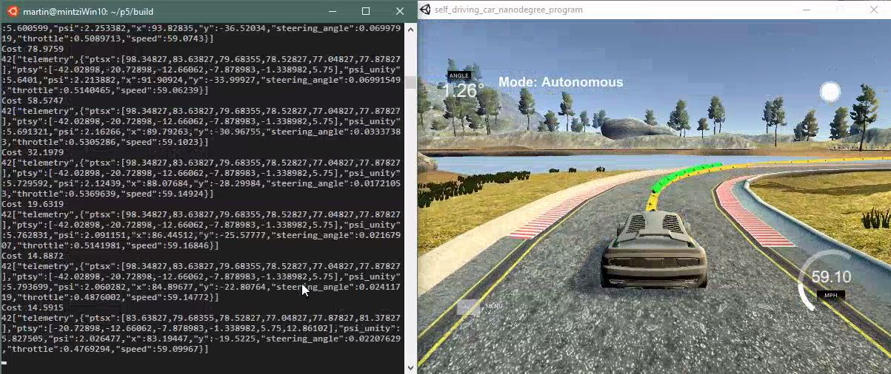
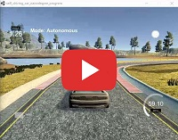

# CarND-Controls-MPC
Self-Driving Car Engineer Nanodegree Program



---

## Project Summary

The task was to build a Model Predictive Controller (MPC) and tuning of its parameters so the car drives savely around the track in the provided simulator. To simulate real-word behaviour an artifical latency of 100ms is added to the actuators of the simulated car.

The program is executed without arguments using the following command:
```
./mpc
```

A video of the car driving one lap in the simulator is uploaded to Youtube:

   [](https://youtu.be/c8Hnqy5eHzE)

## The Model

The kinematic model used is based on the simple bicycle model. Two actuators are used, steering angle (+/- 25 degree) and acceleration (normalized with +/- 1). The model does not take into account forces (e.g. lateral or longitudinal) originating from wind drag, tire friction (no specific tire model used) etc.

The update equations for this specific model were taught in the lesson:

* x_[t+1] = x[t] + v[t] * cos(psi[t]) * dt
* y_[t+1] = y[t] + v[t] * sin(psi[t]) * dt
* psi_[t+1] = psi[t] + v[t] / Lf * delta[t] * dt
* v_[t+1] = v[t] + a[t] * dt
* cte[t+1] = f(x[t]) - y[t] + v[t] * sin(epsi[t]) * dt
* epsi[t+1] = psi[t] - psides[t] + v[t] * delta[t] / Lf * dt

Where:
* x, y: location of the car
* psi: orientation of the car
* v: velocity of the car
* cte: cross track error (distance from lane center)
* epsi: orientation error of the car

## Timestep Length and Elapsed Duration (N & dt)
To choose N (number of future prediction) and dt (update time step) to considerations have to be made. First, they have to match roughly the vehicle that is controlled. A car can drive quite fast and travels a fair distance in a short amount of time (e.g. ~28m at 100km/h). Therefore, N and dt shouldn't make a prediction too far in the future.
Second, both parameters define the number of variables that are optimized by the MPC and drive the computational cost.
I first started with ```N = 10``` and ```dt = 0.15```, which corresponds to a prediction horizon of 1.5 sec. I chose to start with a dt to be larger than the added latency so that the latenct didn't matter at this point of time.
Later in the project I reduced dt to 0.05 to see the effects of latency. I kept ```N = 10``` in order to keep the processing load low (prediction horizon 0.5 sec). Given that the car travels quite fast on the track I think the chosen values are reasonable.

## Polynomial Fitting and MPC Preprocessing
The simulator returns all coordinates and orientation in global coordinates. However, transforming these global values to the car's coordinate systems simplifies calculations a lot. The transformation is a standard 2-D transfomation shown in previous lessons and that was used in previous projects (e.g. Particle Filter) as well:
* waypoint_x_local = ((waypoint_x_global - x_position) * cos(-psi)) - (waypoint_y_global - y_position * sin(-psi))
* waypoint_y_local = ((waypoint_x_global - x_position) * sin(-psi)) + (waypoint_y_global - y_position * cos(-psi))

This transformation leads to x, y and psi being 0.
Hence, the state vector only consists of V, CTE and EPSI.

I used the provided ```polyfit()``` function to fit a polynomial the the transformed waypoints. The polynomial chose was of 3rd order. As stated earlier, due to the transformation x, y and psi are 0. As a consequence, CTE and EPSI can be calculated as follows:
* CTE = polyeval(coeffs, 0)
* EPSI = -atan(coeffs[1])


## Model Predictive Control with Latency
Latency is artificially added to simulate real-world behaviour where there's a delay between the command sent to the actuators and when actuator executed the action.
One way to deal with latency in MPC was to set the controller update interval dt to a value larger than the latency value. For example, with a given latency of 100 ms I set dt to 150 ms and the MPC worked fined and the car drove around the track. However, this way was not really addressing the problem and so I implemented a solution that is more sound.
Anonther way of dealing with latency is to feed the MPC not with the current state of the car but with a predicted car state where the vehicle is assumed to be after the latency period. The new predicted position can be calculated by using the model equations from the lessons (UKF, motion models) and the project's Tips and Tricks:
* delta_x = x + v * dt * cos(psi)
* delta_y = y + v * dt * sin(psi)
* delta_psi = psi + v * (steering_value / Lf) * latency

Both variables x/y are 0 because of the transformation we did earlier, dt is the latency. However, we have to use the steering value instead of psi as we set psi to 0 to the transformation and want the angle relative to the current state. The new orientation is calculated by letting the car drive furhter along at the current speed with respect to set circle constant. The sign is modified to ```-``` due to the return value of the simulator.

CTE and the orientation error EPSI are calculated as before, however, as x is not 0 anymore we have to use the predicted x (after latency) to calculate them, which leads to the following equations:
* cte = polyeval(coeffs, x)
* epsi = -atan(coeffs(1) + coeffs(2) * x + coeffs(3) * x * x)

For simplification, velocity is kept constant for the latency interval.

We now have all 6 state variables that are fed to the MPC, where x,y and psi are predicted after the latency period and cte and epsi are calculated using the predicted x values.

## Final Result

The reference speed has been chosen to deliver quite a smooth driving experience. The car could also drive faster, however, the drive wil be more rough. The current cost factors need to be adjusted to improve the drive for higher speeds.

A video of the car driving one lap in the simulator is uploaded to Youtube:

[](https://youtu.be/c8Hnqy5eHzE)


---

## Dependencies

* cmake >= 3.5
 * All OSes: [click here for installation instructions](https://cmake.org/install/)
* make >= 4.1
  * Linux: make is installed by default on most Linux distros
  * Mac: [install Xcode command line tools to get make](https://developer.apple.com/xcode/features/)
  * Windows: [Click here for installation instructions](http://gnuwin32.sourceforge.net/packages/make.htm)
* gcc/g++ >= 5.4
  * Linux: gcc / g++ is installed by default on most Linux distros
  * Mac: same deal as make - [install Xcode command line tools]((https://developer.apple.com/xcode/features/)
  * Windows: recommend using [MinGW](http://www.mingw.org/)
* [uWebSockets](https://github.com/uWebSockets/uWebSockets)
  * Run either `install-mac.sh` or `install-ubuntu.sh`.
  * If you install from source, checkout to commit `e94b6e1`, i.e.
    ```
    git clone https://github.com/uWebSockets/uWebSockets 
    cd uWebSockets
    git checkout e94b6e1
    ```
    Some function signatures have changed in v0.14.x. See [this PR](https://github.com/udacity/CarND-MPC-Project/pull/3) for more details.
* Fortran Compiler
  * Mac: `brew install gcc` (might not be required)
  * Linux: `sudo apt-get install gfortran`. Additionall you have also have to install gcc and g++, `sudo apt-get install gcc g++`. Look in [this Dockerfile](https://github.com/udacity/CarND-MPC-Quizzes/blob/master/Dockerfile) for more info.
* [Ipopt](https://projects.coin-or.org/Ipopt)
  * Mac: `brew install ipopt`
  * Linux
    * You will need a version of Ipopt 3.12.1 or higher. The version available through `apt-get` is 3.11.x. If you can get that version to work great but if not there's a script `install_ipopt.sh` that will install Ipopt. You just need to download the source from the Ipopt [releases page](https://www.coin-or.org/download/source/Ipopt/) or the [Github releases](https://github.com/coin-or/Ipopt/releases) page.
    * Then call `install_ipopt.sh` with the source directory as the first argument, ex: `bash install_ipopt.sh Ipopt-3.12.1`. 
  * Windows: TODO. If you can use the Linux subsystem and follow the Linux instructions.
* [CppAD](https://www.coin-or.org/CppAD/)
  * Mac: `brew install cppad`
  * Linux `sudo apt-get install cppad` or equivalent.
  * Windows: TODO. If you can use the Linux subsystem and follow the Linux instructions.
* [Eigen](http://eigen.tuxfamily.org/index.php?title=Main_Page). This is already part of the repo so you shouldn't have to worry about it.
* Simulator. You can download these from the [releases tab](https://github.com/udacity/self-driving-car-sim/releases).
* Not a dependency but read the [DATA.md](./DATA.md) for a description of the data sent back from the simulator.


## Basic Build Instructions


1. Clone this repo.
2. Make a build directory: `mkdir build && cd build`
3. Compile: `cmake .. && make`
4. Run it: `./mpc`.

## Tips

1. It's recommended to test the MPC on basic examples to see if your implementation behaves as desired. One possible example
is the vehicle starting offset of a straight line (reference). If the MPC implementation is correct, after some number of timesteps
(not too many) it should find and track the reference line.
2. The `lake_track_waypoints.csv` file has the waypoints of the lake track. You could use this to fit polynomials and points and see of how well your model tracks curve. NOTE: This file might be not completely in sync with the simulator so your solution should NOT depend on it.
3. For visualization this C++ [matplotlib wrapper](https://github.com/lava/matplotlib-cpp) could be helpful.

## Editor Settings

We've purposefully kept editor configuration files out of this repo in order to
keep it as simple and environment agnostic as possible. However, we recommend
using the following settings:

* indent using spaces
* set tab width to 2 spaces (keeps the matrices in source code aligned)

## Code Style

Please (do your best to) stick to [Google's C++ style guide](https://google.github.io/styleguide/cppguide.html).

## Project Instructions and Rubric

Note: regardless of the changes you make, your project must be buildable using
cmake and make!

More information is only accessible by people who are already enrolled in Term 2
of CarND. If you are enrolled, see [the project page](https://classroom.udacity.com/nanodegrees/nd013/parts/40f38239-66b6-46ec-ae68-03afd8a601c8/modules/f1820894-8322-4bb3-81aa-b26b3c6dcbaf/lessons/b1ff3be0-c904-438e-aad3-2b5379f0e0c3/concepts/1a2255a0-e23c-44cf-8d41-39b8a3c8264a)
for instructions and the project rubric.

## Hints!

* You don't have to follow this directory structure, but if you do, your work
  will span all of the .cpp files here. Keep an eye out for TODOs.

## Call for IDE Profiles Pull Requests

Help your fellow students!

We decided to create Makefiles with cmake to keep this project as platform
agnostic as possible. Similarly, we omitted IDE profiles in order to we ensure
that students don't feel pressured to use one IDE or another.

However! I'd love to help people get up and running with their IDEs of choice.
If you've created a profile for an IDE that you think other students would
appreciate, we'd love to have you add the requisite profile files and
instructions to ide_profiles/. For example if you wanted to add a VS Code
profile, you'd add:

* /ide_profiles/vscode/.vscode
* /ide_profiles/vscode/README.md

The README should explain what the profile does, how to take advantage of it,
and how to install it.

Frankly, I've never been involved in a project with multiple IDE profiles
before. I believe the best way to handle this would be to keep them out of the
repo root to avoid clutter. My expectation is that most profiles will include
instructions to copy files to a new location to get picked up by the IDE, but
that's just a guess.

One last note here: regardless of the IDE used, every submitted project must
still be compilable with cmake and make./
